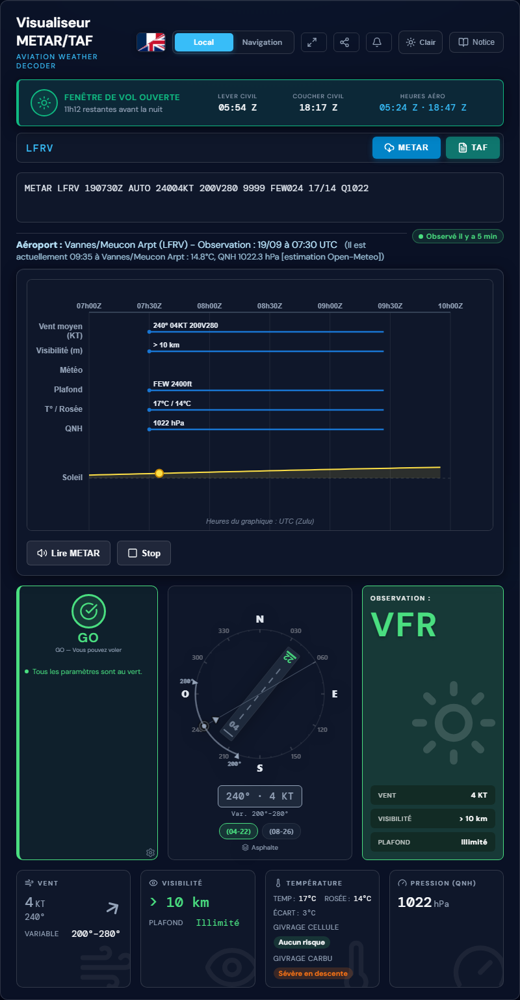
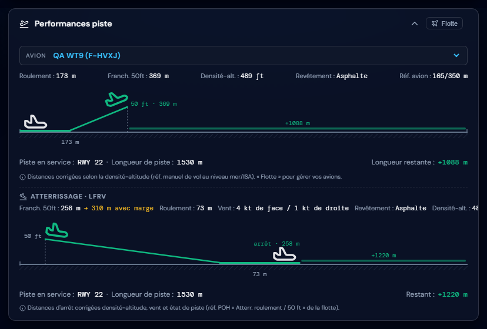
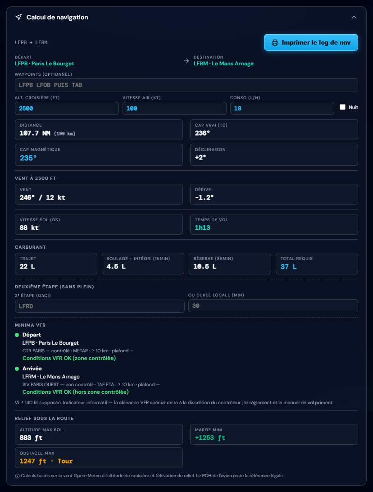
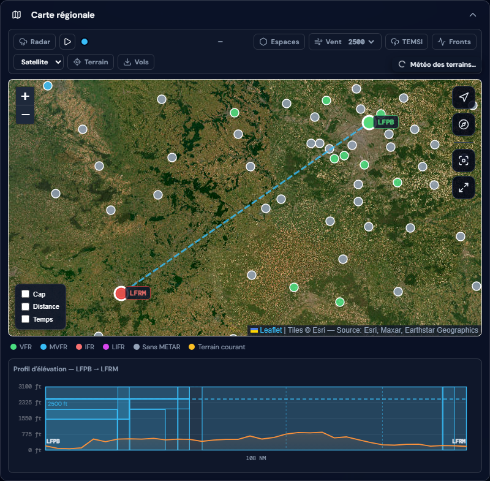

# Visualiseur METAR/TAF

**Météo aéronautique en temps réel pour pilotes VFR** — décodage et visualisation
graphique des METAR/TAF, planification de vol, performances décollage et log de nav,
dans une PWA installable qui fonctionne aussi hors ligne.

🌐 **Application en ligne :** <https://papabear56.pages-perso.free.fr/> (HTTPS — PWA installable, suivi GPS actif)

## Captures d'écran

| Météo & rose des vents | Performance décollage |
|:---:|:---:|
|  |  |

| Calcul de navigation | Carte régionale & profil d'élévation |
|:---:|:---:|
|  |  |

---

## Fonctionnalités

### Météo & briefing
- **METAR / TAF** décodés en clair et visualisés graphiquement (rose des vents
  animée, piste en service publiée par la rose des vents, tendances sur 24 h).
- **Widgets météo** : température / point de rosée, tendance de pression,
  **givrage carburateur** (zones à risque), niveau de congélation, vents en
  altitude, plafond & visibilité.
- **SIGMET / AIRMET** actifs autour du terrain : évalués pour le GO/NO-GO
  (plus tracés sur la carte — retour pilote). Les PIREP ont été retirés.
- **Radar de précipitations** (RainViewer) en superposition carte.
- **Fenêtre de vol jour VFR** avec alerte de nuit (crépuscules calculés).
- **Mode cockpit** (briefing express ultra-lisible) et **thème clair /
  sombre** persistant (l'ancien « mode nuit rouge » a été remplacé par le
  thème clair de briefing).
- **Badge d'âge des données** : pilule verte / ambre / rouge selon la
  fraîcheur du message, **au rythme propre à son type** — METAR observé
  toutes les heures (vert < 1 h, rouge ≈ 2 h) ; TAF émis toutes les ~6 h
  (« Émis il y a… », vert < 6 h 30, rouge > 12 h). En cas de panne réseau,
  le dernier message reste affiché, en rouge avec son âge — jamais une
  donnée périmée présentée comme courante.
- **Watchdog** : surveillance active des terrains favoris.

### Navigation
- **Planificateur de vol** : recherche de terrain par code OACI (validation
  alphanumérique, ex. CNU8 ou K6RE), waypoints intelligents ou libres,
  alternates, compagnie du trajet, autocomplétion. Le champ « Waypoints »
  affiche les **vrais noms** des repères (VOR, NDB, points de repère VFR).
- **Log de nav PDF multi-pages** : au-delà de 9 tronçons, une page « VFR
  Flight Log (suite) » prolonge le log dans la même trame (lignes vierges +
  checks en bas de page) ; le tableau des calculs remplit la page avant
  d'appeler « Détail des waypoints (suite) ».
- **Carte régionale** (Leaflet) : route, étiquettes de tronçons
  (cap / distance / temps), espaces aériens — **base officielle SIA (XML
  AIRAC) en priorité**, complétée par openAIP (ATZ, reste du monde), radar.
- **Suivi GPS** (mobile, HTTPS) : position de l'avion sur la carte
  régionale avec cercle de précision et **trace du trajet**, orientation
  « Nord / Route » (la carte tourne pour placer votre cap vers le haut),
  écran maintenu allumé pendant le suivi (Wake Lock). Chaque session est
  enregistrée automatiquement sur l'appareil (position, altitude GPS,
  vitesse, cap — sessions < 5 min ignorées) ; le bouton « Vols » liste les
  vols, rejoue leur trace et les exporte en **GPX / KML**. Tapez l'avion
  pour afficher à la demande vitesse sol, altitude GPS, cap et temps de vol ;
  le chrono de vol démarre au décollage réel (VR de l'avion actif de la
  flotte − 5 kt, sans avion : 50 kt). Actif sur
  <https://papabear56.pages-perso.free.fr/> ; grisé sur l'adresse HTTP.
- **Dossier NOTAM officiel (SOFIA-Briefing, SIA)** : dans le panneau
  « NOTAM (SOFIA) » — en navigation, le dossier suit le **plan** (départ,
  FIR, points de passage vérifiés un à un — même sans NOTAM, arrivée) ; en
  vol local, une **zone autour du terrain** observé — **20 NM par défaut,
  réglable de 10 à 40 NM** — avec le dossier de **chaque terrain situé dans
  ce rayon** (l'AD observé en tête, prioritaire, « aucun NOTAM VFR » affiché
  quand un terrain n'en a pas). NOTAM filtrés
  **VFR**, plafond **FL du plan**, texte **traduit en français**, groupés
  par familles officielles. **Cases par NOTAM et par catégorie** : seuls
  les cochés sont ajoutés en **annexe du log de nav PDF**. Fraîcheur
  garantie par le bouton Actualiser (aucun cache).
- **Radiophares et points VFR mondiaux** (openAIP, actualisés chaque
  semaine par un cron GitHub) : couches VOR / NDB / points de repère
  VFR activables case par case dans le menu du bouton « Espaces », avec
  allègement selon le zoom — chaque point est utilisable comme waypoint
  du plan de vol.
- **Obstacles** (base officielle **SIA**, export AIXM « Obstacles Model ») :
  ~13 800 obstacles en France et outre-mer — éoliennes, pylônes, mâts,
  châteaux d'eau, cheminées, bâtiments… — avec icône par type, hauteur,
  altitude du sommet et **balisage lumineux** au clic ; visible à partir
  d'un zoom régional, mise à jour à chaque cycle AIRAC (28 j).
- **Profil d'élévation** du trajet (Open-Meteo) en NM par tronçon, avec les
  **espaces traversés** : limites tracées en traits verticaux (bleu carte)
  et, sur le PDF, nom du secteur + fréquence en vertical entre les limites.
- **Météo de route** sur chaque waypoint, créneaux de vol par étape.
- **Permalien complet** du plan de vol (départ / destination / waypoints),
  partageable par QR code.
- **Sauvegarde / import** du plan de vol : JSON natif, **GPX** et **KML**.
- **Fiche terrain en deux onglets** : « Fréquences » (fréquences
  officielles SIA avec observations — secteurs d'approche, fréquences
  suppléantes — et codes d'horaires H24/HO…) et « Info terrain »
  (altitude, déclinaison, ouverture VFR/IFR, statut, pistes en clair,
  horaires du service et avitaillement en sous-sections repliables).
- **Pastilles de la carte régionale** : clic = METAR + bouton
  « Carte VAC » du terrain ; **clic droit = ajout au plan de vol** comme
  waypoint. Terrains sans station METAR propre (pastille grise) : le clic
  ouvre le METAR de la **station la plus proche** — station et distance en
  tête du popup, code marqué « * » — et tout terrain de la carte peut
  servir de départ, d'arrivée ou d'étape.
- **Carte VAC « Atterrissage à vue »** intégrée : Atlas-VAC officiel du
  SIA (421 terrains de France, AIRAC), visionneuse pdfjs avec zoom et
  pages, **consultable hors ligne** après première ouverture (cache
  IndexedDB).

### Performances & masse
- **Performance décollage** : flotte d'avions personnalisable (Cessna, Piper,
  Robin, DR400…), correction densité-altitude, revêtement de piste (herbe,
  dur sec/humide/contaminé), piste en service pilotée par la rose des vents,
  schéma en coupe (roulement → rotation → franchissement 50 ft) avec marge
  restante ou manque.
- **Masse & centrage** : centrogramme par avion (enveloppe, postes, carburant),
  points Décollage / Arrivée / ZFW, page dédiée du PDF, pré-remplissage depuis
  le plan de nav en mode navigation.
- **Log de nav PDF** (3–4 pages) : waypoints, alternates, météo, terrain,
  performances et centrage — généré dans le navigateur, sans serveur.
  Alternates : **8 terrains régulièrement espacés le long du trajet**
  (± 25 NM de la route, le plus proche dans chaque secteur, avec ou sans
  station météo propre — « * » = METAR de la station la plus proche).

### Général
- **PWA installable** sur l'adresse HTTPS de Free :
  <https://papabear56.pages-perso.free.fr/> (service worker actif,
  installation mobile / bureau, shell hors ligne, **suivi GPS** —
  géolocalisation exigée par les navigateurs en contexte sécurisé).
- L'adresse historique <http://papabear56.free.fr/> (HTTP seul) sert les
  mêmes fichiers : l'application y fonctionne comme un site classique
  (cache navigateur IndexedDB, versions rafraîchies au rechargement), le
  suivi GPS y est grisé.
- Le miroir GitHub Pages (metar-taf-pwa) a été retiré le 09/09/2026 —
  l'adresse HTTPS officielle est celle de Free ci-dessus.
- **Interface française / anglaise**, thème sombre / clair.
- **Notice utilisateur bilingue** (FR/EN) : icônes et contrôles reproduits
  à l'identique de l'application (Lucide, pastilles, segments), contenu
  100 % utilisateur — le journal des versions et les procédures de
  maintenance vivent dans ce README (mis à jour automatiquement à chaque
  publication).
- **Mention de paternité SIA** conforme à la licence de réutilisation,
  en pied de page de l'application (date du cycle AIRAC en vigueur,
  calculée automatiquement).

## Sources de données

| Source | Usage |
|---|---|
| [aviationweather.gov](https://aviationweather.gov/) | METAR, TAF, SIGMET, infos stations |
| [SIA](https://www.sia.aviation-civile.gouv.fr/) (eAIP + XML AIRAC) | Fréquences officielles des terrains, espaces aériens France, radiophares, obstacles — cycle AIRAC 28 j (paternité mentionnée dans l'application) |
| [SOFIA-Briefing](https://sofia-briefing.aviation-civile.gouv.fr/) (SIA) | Dossiers NOTAM officiels (plan de vol et zone 30 NM), via le relais |
| [Open-Meteo](https://open-meteo.com/) | Prévisions, élévation, vents en altitude |
| [openAIP](https://www.openaip.net/) | Terrains, espaces aériens mondiaux, radiophares et points VFR |
| [RainViewer](https://rainviewer.com/) | Radar de précipitations |
| Relais CORS (Cloudflare Worker, dossier `worker/`) | Proxy met en cache les requêtes météo |

## Développement

Prérequis : **Node.js ≥ 18** (tests `node --test`).

```bash
npm install     # devDependencies (basic-ftp pour le déploiement)
npm test        # suite complète (~250 tests : cœur, plan de vol, perfs, centrage…)
```

- `index.html` — application (vanilla JS, modules ES, aucun framework).
- `js/` — modules applicatifs (`engine`, `flight-planner`, `route-weather`,
  `takeoff-ui`, `wb-core`, `navlog-pdf`, `gps` + `gps-vols`, `data-age`,
  `map-registry`, `notam`…), volontairement découplés
  et testables sous Node.
- `test/` — tests unitaires + **pages d'aperçu** autonomes (QA visuelle des
  schémas, génération d'aperçus PDF) — non exécutées par `npm test`.
- `vendor/` — dépendances bundlées (Leaflet + leaflet-rotate, jsPDF, pdf.js,
  Lucide, geomag) pour un fonctionnement 100 % hors ligne.
- `worker/` — code du relais CORS (Cloudflare Worker, proxy météo avec cache
  + route `POST /notam` vers SOFIA-Briefing ; déploiement :
  `cd worker && npx wrangler deploy`). `scripts/dev-notam-relay.mjs` = même
  route en local pour le développement (sans Worker). `apps-script/` conserve
  l'ancien relais Google Apps Script (historique / repli).

## Déploiement

À chaque push sur `Version-2.0`, **GitHub Actions** déploie automatiquement par
FTP sur Free.fr, bump les versions PWA et committe le marqueur `[deploy]`
(workflow `.github/workflows/deploy-ftp.yml`, secrets `FTP_SERVER`,
`FTP_USER`, `FTP_PASSWORD`). Les ~27 000 cellules openAIP
(`data/airspaces/cells/`) sont **exclues de cet upload** (débit Free.fr
insuffisant) : elles partent par **`npm run cells`** — upload incrémental
local qui ne pousse que le delta (identifiants dans `deploy.config.json`,
gitignoré ; `--dry-run` pour simuler, `--mirror` pour purger les orphelins).

En local, la routine complète tient en une commande :

```bash
npm run pub -- "message du commit"   # commit + push + attente du déploiement
```

### Surveillance automatique

- **Health-check toutes les 6 h** (`health-check.yml`) : site HTTPS en ligne
  + relais météo vivant **et** utile (un vrai METAR traverse le Worker de
  bout en bout) ; échec → notification GitHub. Lançable à la main :
  `node scripts/health-check.mjs`.

### Données aéronautiques — mises à jour automatiques

- **Cron hebdomadaire** (`update-radio-points.yml`, lundi 05:30 UTC) : crawl incrémental des
  espaces aériens openAIP (cellule 1°), fréquences SIA (à chaque nouvel
  AIRAC), radiophares + points VFR (lundi).
- **Obstacles SIA** : extraits de l'export AIXM « Obstacles Model »
  téléchargé manuellement à chaque cycle AIRAC → `node scripts/fetch-obstacles.mjs`.
  Un **garde-fou** (job `airac-obstacles`) fait échouer le workflow hebdomadaire
  — notification GitHub — tant que la base est en retard sur le cycle en
  vigueur.
- **Base SIA (XML bd SIA)** — terrains (identité, horaires ATS,
  avitaillement, téléphone), pistes, espaces France, fréquences
  services/A-A : export `XML_SIA_<date>.xml` téléchargé à chaque cycle →
  `node scripts/fetch-sia-airac.mjs --xml="…"`.
- **Cartes VAC « Atterrissage à vue »** : extraites de l'**Atlas-VAC** du
  ZIP « eAIP complet » du portail SIA (≈1 Go) → `node
  scripts/fetch-vac-atlas.mjs` (421 terrains vers `data/vac-sia/`).
- **Garde-fou AIRAC global** (`airac-sia-xml` + `airac-obstacles`) :
  échec/notification dès qu'une base (terrains, pistes, espaces,
  fréquences, obstacles, cartes VAC) est en retard sur le cycle vigueur.


## Journal des versions
- **2026-09-06** — CARTES VAC « ATERRISSAGE À VUE » — LA SEULE RETENUE (choix pilote 06/09 : « ce sont ces cartes là qu il faut, les autres ne sont pas nécessa…
- **2026-09-06** — FIX DÉPLOIEMENT visionneuse VAC (diagnostic pilote : GET vendor/pdfjs-3.11.174.min.js → 404 sur le MIROIR) : pdfjs était exclu des DEUX dépl…
- **2026-09-06** — FIX SW « vieille app malgré la bonne version » (2ᵉ retour pilote « toujours 1 seule carte en v1.244 » alors que les 2 canaux servent bien ch…
- **2026-09-05** — FIX RADICAL « toujours 1 seule carte en v1.243 » : le bump de clé IDB ne suffisait pas — l URL HTTP restait freq-sia.json?t=0, identique pou…
- **2026-09-05** — FIX « je n ai qu une carte » : les visiteurs ayant déjà chargé la fiche terrain hier/ce matin gardaient freq-sia.json SANS le champ charts e…
- **2026-09-05** — CARTES VAC MULTI-CARTES (retour pilote « il n y a pas toutes les cartes du terrain ») : chaque terrain publie en réalité des DOSSIERS de car…
- **2026-09-05** — CARTES VAC OFFICIELLES dans l app (choix pilote ③ visionneuse + hors ligne) : les cartes d aérodrome du SIA (AD_2_XXXX_ADC_01.pdf, ~143 terr…
- **2026-09-05** — GARDE-FOU AIRAC de la base XML SIA (question pilote « les infos seront-elles mises à jour à chaque AIRAC ? ») : nouveau job airac-sia-xml da…
- **2026-09-05** — FRÉQUENCES v5 : OBSERVATIONS OFFICIELLES eAIP par fréquence (réponse à « différencier les 6 approches de Nantes ») : la colonne Observations…
- **2026-09-05** — FRÉQUENCES : GONIO supprimées + badges horaires (retour pilote 05/09) : ① les fréquences VDF « Gonio » dupliquent les organes existants (ex.…
- **2026-09-05** — FICHE TERRAIN v3c — valeurs à la suite des deux-points confirmées + BUG RACE hors France : le widget pouvait s afficher AMPUTÉ (pays/altitud…
- **2026-09-05** — FICHE TERRAIN v3b (ajustement pilote) : les valeurs de la section Terrain suivent DIRECTEMENT les deux-points (« Alt. terrain : 124 ft », « …
- **2026-09-05** — FICHE TERRAIN v3 — feu vert pilote après aperçu PDF (Apercu_fiche_terrain.pdf, 3 terrains LFRN/LFRV/LFPF) : section Terrain en LIGNES LIBELL…
- **2026-09-05** — FICHE TERRAIN v2 (retours pilote : ordre + lisibilité) : ① FRÉQUENCES en tête (sans sous-titre redondant) ② PISTES (seuils officiels affiché…
- **2026-09-05** — FICHE TERRAIN COMPLÈTE dans l onglet « Fréquences & info terrain » (demande pilote, 4 arbitrages validés) : ① IDENTITÉ en chips — élévation,…
<!-- docs:lastSha=95007875712ac35e9f66559264e0332888ca2db3 -->


## Crédits & licences

- [Leaflet](https://leafletjs.com/) (BSD-2) — cartographie, avec le plugin
  [leaflet-rotate](https://github.com/Raruto/leaflet-rotate) (MIT) pour
  l'orientation « Route haut » du suivi GPS.
- [jsPDF](https://github.com/parallax/jsPDF) (MIT) — log de nav PDF.
- [Mozilla pdf.js](https://github.com/mozilla/pdf.js) (Apache-2.0) — aperçus PDF.
- [Lucide](https://lucide.dev/) (Apache-2.0) — icônes (dont l'avion du schéma
  de décollage, tracé `plane-takeoff`).
- Données aéronautiques : aviationweather.gov (NOAA), **SIA / DGAC**
  (eAIP France, export XML AIRAC, Atlas-VAC — fréquences, terrains,
  espaces, obstacles, cartes VAC), openAIP et contributeurs.
- **Licence de réutilisation SIA** : les données réutilisées le sont sous
  la licence gratuite du Service de l'Information Aéronautique — la mention
  de paternité complète (source, URL, date de mise à jour = cycle en
  vigueur) est affichée dans le pied de page de l'application.

## ⚠️ Avertissement

Cet outil est une **aide au briefing** : il agrège et met en forme des
informations publiques. Il ne remplace ni les sources officielles (SIA,
NOTAM, aviationweather.gov), ni le jugement du pilote, ni les performances
du manuel de vol de l'aéronef. **Responsabilité du commandant de bord.**
